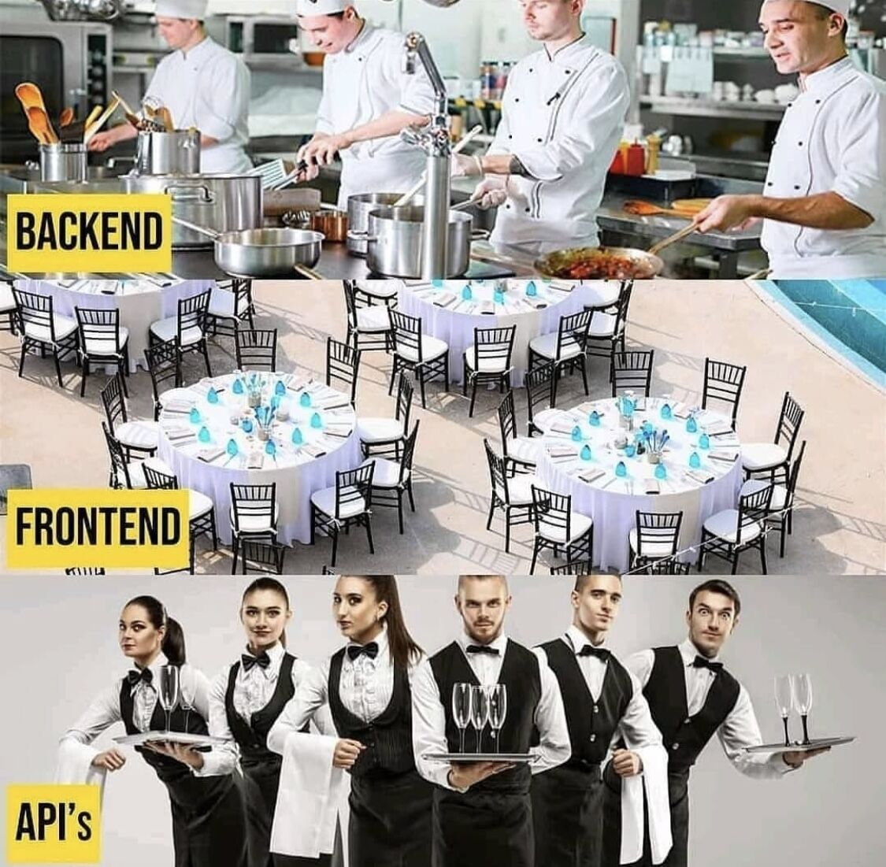

## O Protocolo HTTP

O Hypertext Transfer Protocol (*Protocolo de Transferência de Hipertexto*) é a espinha dorsal da comunicação na internet. A partir dele estabelece as **regras** e **formatos** para a **troca de informações**, desde a simples solicitação de uma página da web até a transferência de arquivos complexos e interações em tempo real entre aplicativos distribuídos em locais distintos.

### Arquitetura

Funciona através da arquitetura `cliente-servidor`, é o responsável por permitir a troca de **dados**, ou mensagens, entre **clientes**, e **servidores**. Essa troca de mensagens ocorre de maneira **organizada** e **previsível**, permitindo que os usuários naveguem na *web*, enviem e recebam *e-mails*, realizem compras *online* e muito mais.

Quando um **cliente**, como um navegador, um programa de computador, ou um app de smartphone, faz uma requisição (`request`), o **servidor** responde com uma resposta (`response`).

> Cliente e Servidor são nada menos do que **softwares** em **algum computador**! Sendo eles um **aplicativo** ou **serviço** que contem o **recurso** que estamos acessando.

### Fluxo da Requisição-Resposta

As requisições `HTTP`, são o ponto de partida desse processo. Elas são compostas por diferentes elementos, incluindo o **método** de solicitação, a **URL** do recurso desejado e opcionalmente dados adicionais, como **parâmetros de consulta**, **corpo da solicitação**, e **cabeçalhos**.

> Por exemplo, ao clicar em um *link* ou preencher um formulário em um *site*, o navegador envia uma requisição *HTTP* para **acessar** a página ou **enviar** os dados inseridos.

<!-- TODO Criar conteudo sobre os Metodos HTTP e adicionar a referencia aqui-->

A `URL` (*Uniform Resource Locators* - Localizador Uniforme de Recursos) é o exata localização lógica do **recurso** acessado.

<!-- TODO Expandir mais sobre a anatomia da URL e adicionar a referencia aqui-->

Essas solicitações são então enviadas ao servidor por uma **API** (`Application Programming Interface` - Interface de Programação de Aplicativos). A *API* atua como um **intermediário** entre o cliente e o servidor. Ela interpreta a solicitação, realiza as operações necessárias, como acessar um banco de dados ou processar dados, e prepara uma resposta para enviar de volta ao cliente.

> Uma *API* é tanto responsavel por trazer as informações ao **cliente**, quanto levar as solicitações ao **servidor**. Podendo ser a mesma *API*, ou *APIs* distintas em momentos distintos (Ver assincronicidade em requisição WEB)

<!-- TODO Criar conteudo sobre assincronicidade e adicionar a referencia aqui-->

A **resposta** *HTTP* é a contraparte da solicitação e é composta por um **código de status** (ver sobre HTTP Status Code), **cabeçalhos** e, opcionalmente, um **corpo da resposta**.

<!-- TODO Criar conteudo sobre HTTP Status Code e adicionar a referencia aqui-->

O **código de status** indica se a solicitação foi bem-sucedida, encontrou um erro ou requer ação adicional.

Os **cabeçalhos** fornecem informações adicionais sobre a resposta, como o tipo de conteúdo, a codificação, a data da última modificação, cookies, autenticação, e muito mais.

<!-- TODO Criar conteudo sobre token JWT para explicar autenticação  e adicionar referencia aqui -->

<!-- TODO Criar conteudo sobre cookies e adicionar a referencia aqui-->

O **corpo da resposta** contém os dados solicitados pelo cliente, como o *HTML*, *CSS*, *JavaScrit*, imagens, videos, etc, de uma página da web, ou os resultados de uma consulta de banco de dados.

### Independencia entre as Trocas de Mensagem

É importante notar que o *HTTP* é `stateless` (sem estado), ou seja, cada solicitação é tratada **independentemente** das anteriores. Isso oferece vantagens em termos de **simplicidade** e **escalabilidade**, mas também apresenta desafios quando se trata de manter o estado do aplicativo e permitir interações complexas. Para contornar essa limitação, são utilizados mecanismos como `cookies` e `cabeçalhos de autenticação` para manter a continuidade da sessão entre as solicitações, que são trocados entre **todas** as requisições e respostas, quando necessário.

> É papel do **servidor** em tratar esta continuidade, não do protocolo *HTTP* em si. É considerado uma **falha de segurança** quando o servidor libera acesso a um recurso sem se importar com esta continuidade, caso exista.

### Segurança

Para garantir a **segurança**, o *HTTP* pode ser estendido com protocolos adicionais, como o `HTTPS` (*HTTP Secure* - HTTP Seguro), que utiliza **criptografia** *SSL/TLS* para assegurar a **confidencialidade** e **integridade** dos dados transferidos entre cliente e servidor (Ver introdução à segurança da informação). Isso é essencial para **proteger** informações sensíveis, como dados de login, informações de pagamento e comunicações confidenciais, contra interceptação e adulteração por partes mal-intencionadas na internet.

<!-- TODO Migrar conteudo sobre segurança da informação e adicionar a referencia aqui-->

## Client-side vs Server-side

### Client-side

### Server-side

## Referencias

- [MOZILLA DEVELOPER NETWORK. Como a Web funciona. MDN Web Docs, 2023. Acesso em: 05/05/2024.](https://developer.mozilla.org/pt-BR/docs/Learn/Getting_started_with_the_web/How_the_Web_works)
- [MOZILLA DEVELOPER NETWORK. HTTP. MDN Web Docs, 2023. Acesso em: 05/05/2024.](https://developer.mozilla.org/pt-BR/docs/Web/HTTP)
- [W3Schools. What is HTTP?. Acessado em: 05/05/2024](https://www.w3schools.com/whatis/whatis_http.asp)
- [AKEMI, A. HTTP: um guia completo sobre o que é e como funciona o protocolo da web. Alura. Acessado em: 05/05/2024](https://www.alura.com.br/artigos/http)
